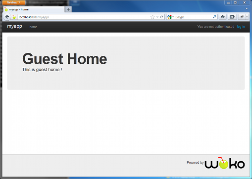
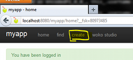
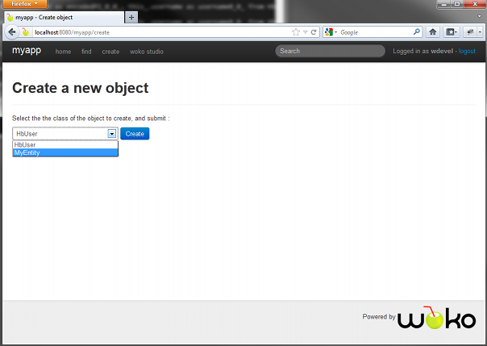
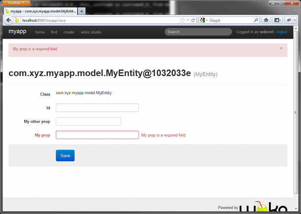
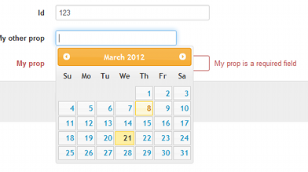
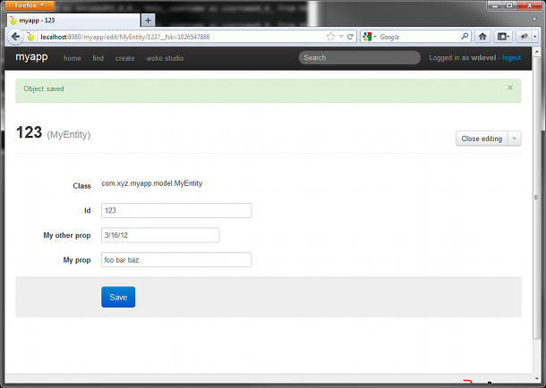
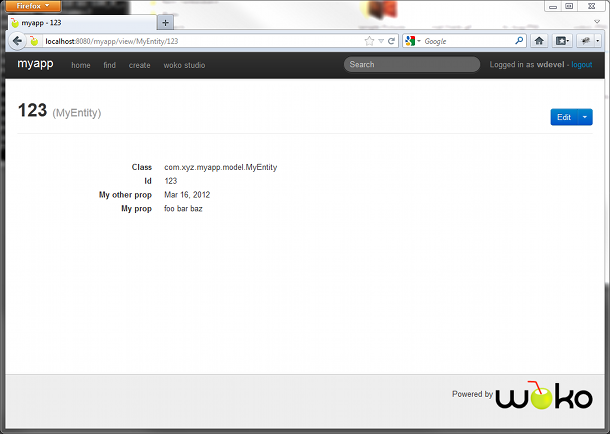
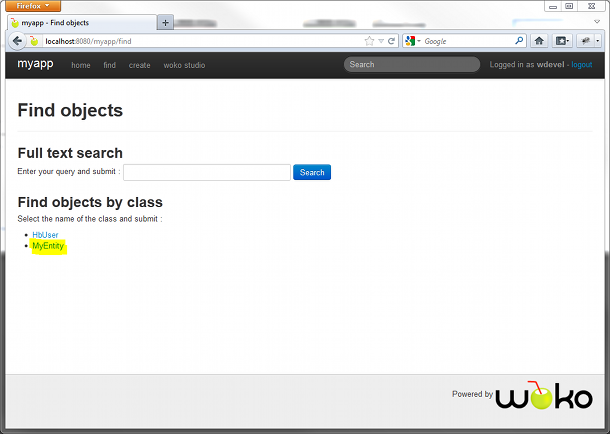
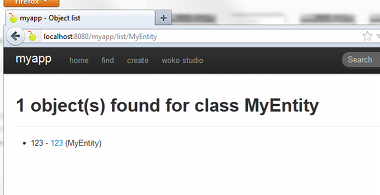
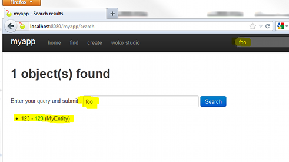

Title:  Woko Tutorial
Author: Rémi Vankeisbelck 
  Alexis Boissonnat
CSS: bootstrap.css
CSS: doko.css
HTML header:  
HTML header:  
  
# Woko Tutorial  
  
## About

This tutorial aims at covering the main aspects of Woko through practical examples.

We'll be using the default "Reference Implementation" (hibernate etc.), but the same concepts applies to other implementations of `ObjectStore`, `UserManager` etc. 

# Environment setup

You'll need to install the `woko` shell script to go through this tutorial. Follow instructions explained [here](https://github.com/pojosontheweb/woko/wiki/Download). 

Make sure the `woko` command is available in your PATH before you start.

# Project init

A Woko app needs several dependencies to be configured in the pom etc. The `woko` script can initialize the whole thing for you.

Open a command prompt, switch to a folder of your choice and create a new Woko project :

    $ cd ~/projects
    $ woko init

The command will ask you for some basic info about your project. You can pick default values for everything excepted the `groupId` and `artifactId`  :

    $ woko init
    __       __     _  __
    \ \  _  / /___ | |/ / ___
     \ \/ \/ // o \|   K /   \
      \__W__/ \___/|_|\_\\_o_/  2.0
                 POJOs on the Web !

    Initializing project
    > Project name ? myapp
    > Maven groupId ? com.myco.myapp
    > Your project's version ? [1.0-SNAPSHOT] 
    | Generating your project, please wait, it can take a while to download everything...
    > Would you like to use Bootstrap for UI ? [y] :
    > Would you like to use Groovy ? [y] :
    > Specify your default package name [com.myco.myapp] :
    > Would you like enable the woko 'push' command ? [y] :
    |  - web.xml file created : src/main/webapp/WEB-INF/web.xml
    |  - Layout facet created : com.myco.myapp.facets.MyLayout
    |  - resource bundle created : myapp/src/main/resources/application.properties
    |  
    |  Your project has been generated in : myapp.
    |  Run 'woko start' in order to launch your app in a local Jetty container  

This creates a `myapp` project in the current directory :

    myapp/
        pom.xml
        src/
            main/
                groovy/
                    com/
                        myco/
                            myapp/
                                facets/
                                    MyLayout.groovy
                                model/
                                    MyEntity.groovy 
                                woko/
                                    MyappInitListener.goovy
                resources/
                    application.properties
                webapp/
                    WEB-INF/
                        web.xml                                

* pom.xml : maven pom with everything pre-configured 
* MyLayout.groovy : maven pom with everything pre-configured
* MyEntity.groovy : example of an entity class using JPA
* MyappInitListener.goovy : init listener for the app, starts-up your Woko
* application.properties : resource bundle for the app
* web.xml : WebApp XML descriptor, configured with Stripes, Woko, etc.      

# Domain Classes

The very first step when starting a Woko app is to define the Domain Classes : the entities that represent your model. 

Here's the example that has been generated in our project :

    // src/main/groovy/myapp/com/myco/myapp/model/MyEntity.groovy

    package com.myco.myapp.model

    import org.compass.annotations.Searchable
    import org.compass.annotations.SearchableId
    import org.compass.annotations.SearchableProperty
    import javax.validation.constraints.NotNull

    import javax.persistence.Entity
    import javax.persistence.Id

    @Entity
    @Searchable
    class MyEntity {

        @Id
        @SearchableId
        Long id

        @NotNull
        @SearchableProperty
        String myProp

        Date myOtherProp

    }

And that's it. A `MyEntity` POJO with persistence, validation and full-text search enabled. Your class will be scanned at startup, and ready for use. 

> The built-in `HibernateCompassStore` supports Hibernate, Hibernate Validator and Compass mapping annotations. Refer to their docs for more infos about them.

# Full Defaults

You don't have to write anything more than a Domain Class to start playing with your application. Get back to your terminal, and start the app :

    $ woko start

This will compile and build the project, start jetty, and deploy your application. You can now point your browser to :

[http://localhost:8080/myapp](http://localhost:8080/myapp)

## Guest Home

What you'll see when visiting the app is the guest home page. That's what unauthenticated users see of your application by default. 

We have chosen not to show Domain Objects to guest users by default, so there's nothing more to see than this home page at the moment. Of course, you can easily change the contents of the default guest home page later, and provide access to your model as you want. 

## The developer role

By default, your Woko application includes a specific user, of role `developer`. This user has all CRUD privileges on your Domain Objects, plus a few "power features" that we'll explain later.

You can use the default credentials in order to log-in :

* username : wdevel
* password : wdevel

As you can see, developers also have their home page, but this time with a few items in the nav bar :

For now, let's try the CRUD features on our `MyEntity` Domain Class. 

## Zero-LOC CRUD 

Let's first create an instance of our Domain Class. Click the _create_ link in the nav bar :

As you can see, Woko has found your Domain Class, you can select `MyEntity` from the list, and submit :

A FORM is generated for your POJO, with input fields for first-level properties :

A few things to notice here :

* Woko has dynamically introspected your Domain Class, and rendered a FORM that allows to change its state. 
* Constraint Validations are taken into account (the `@NotNull` on `myProp`)
* Input fields are generated based on the type of the object's properties (there's even a date picker component for `myOtherProp`

Now fill in some values and save :

The object has been saved. We can now close the edit mode :

And now get a "read-only" view of our `MyEntity` instance :

As you can see, Woko has now generated plain HTML for the object's properties. Again, it's using the types and metadatas found on the object (e.g. the formatted date). 

Developer users can also list objects by class :

And use full text search, as defined in the POJO's annotations :

In short : all CRUD operations on your Domain Classes (plus full text search) are available for free. Woko generates the User Interface dynamically without you writing any single line of code for it.

## RPC and JavaScript

Woko includes out of the box support for RPC. All default features are available as JSON/HTTP services. Every feature covered by this tutorial so far can be realized using any code that speaks HTTP and JSON, using a simple protocol. 

With the app still running, log in as wdevel and try this :

[http://localhost:8080/myapp/save/MyEntity?object.id=123&object.myProp=foobar&createTransient=true&isRpc=true](http://localhost:8080/myapp/save/MyEntity?object.id=123&object.myProp=foobar&createTransient=true&isRpc=true)

The `isRpc` request parameter tells Woko that the request is to be handled as JSON/HTTP. Woko does the same job as usual, except that it returns the result of the operation as JSON. In this example, it returns the freshly created object :

    {
        "id": 123,
        "myProp": "foobar",
        "class": "MyEntity",
        "_wokoInfo": {
            "title": "123",
            "className": "MyEntity",
            "key": "123"
        }
    }

Again, all the features are available out of the box. For AJAX situations, it's even simpler using the `woko.rpc.Client` JavaScript API. It provides all default features, plus arbitrary facet invocation. 

Log in again as developer, open firebug and go to :

[http://localhost:8080/myapp/save/MyEntity?object.id=123&object.myProp=foobar&createTransient=true](http://localhost:8080/myapp/save/MyEntity?object.id=123&object.myProp=foobar&createTransient=true)

You have saved the object. Now go to firebug console and play :

    // load MyEntity with ID 123 and store to global for the example
    wokoClient.loadObject("MyEntity", 123, { 
        onSuccess: function(o) { 
            myEntity = o;
            console.log(myEntity);
        }
    });
    
You can even update the object :

    myEntity.myProp = "this is funky";
    wokoClient.saveObject({
        obj:myEntity, 
        onSuccess:function(savedObject) {
            console.log(savedObject.myProp); 
        }
    });

And check that it's been saved :

    wokoClient.loadObject("MyEntity", 123, { 
        onSuccess: function(o) { 
            console.log(o.myProp);
        }
    });   

# Overriding the defaults

This section explains how the default features can be customized. It shows some typical examples of changing Woko's behavior when you need it. It also gives a glance of how you can write Resolution Facets in your app to perform various tasks.

TODO explain how you can override the title, properties etc. Show an example in edit mode.

# Resolution Facets

TODO explain how to completely override /view, and how to write a sample Resolution Facet that does something
