Title:  Woko In a Nutshell  
Author: Rémi Vankeisbelck 
  Alexis Boissonnat
Date:   27th feb. 2013  
CSS : bootstrap.css
CSS : responsive.css

# Introduction #

Woko is a Full-Stack, [Domain Driven](http://en.wikipedia.org/wiki/Domain-driven_design) framework for building JEE webapps efficiently. It provides solutions to the recurrent webapp programming issues, as well as a unique approach for developing iteratively and in a consistent manner.

Woko is about displaying Domain Objects to end users, and allow them to interact. That's what every application is about. We use GUI paradigms and widgets in order to represent some state to the end user, allow her(him) to change that state and trigger behavior based upon user interaction. 

Strangely, few frameworks or tools are making it that obvious, because business logic is often buried under loads of glue code. You often spend more time trying to solve recurrent, non-productive issues instead of the actual problem. And you often end up with non-expressive code, so far from the requirement that all intent is lost. 

Woko is designed around a few basic principles that allow to code better webapps, and to do it faster :

* _Domain_ and _Role Driven_ : Woko works with Objects, and aims at allowing your users to work with them too.
* Use _metadata_ : Woko tries to grab the most it can from your code, so that it can provide many features out of the box.
* Sensible _defaults_ : Works out of the box, without config or extension, but allows to customize everything when you need it. 
* _KISS_ : Woko is simple, that's why it works.

# The Object Oriented Wiki #

Woko stands for "The Object Oriented Wiki". The idea is that, like in a regular wiki, end users can view/edit/delete (the usual CRUD suspects) pages, and navigate from a page to another using hyperlinks. Wikis usually provides ACLs or other permissions so that admins can decide "who can do what" with the pages. 

Woko applies this principle to Object Oriented Programming : instead of manipulating "Pages", end users deal directly with Domain Objects in their browser. Woko handles all CRUD operations out of the box on your Domain Objects, and lets you fine-tune everything as you want so that your users can interact with your model. 

<center>
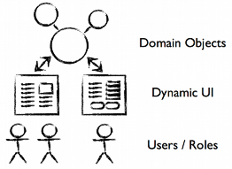
</center>

More than only plumbing and glue code, Woko offers a real framework and high-level semantics for developing Domain-Driven, user-aware web applications. It provides a foundation that you build upon in order to avoid re-inventing yet another wheel.

## Facets ##

Woko uses Facets in order to perform profile-based operations. They sit in between the user and the objects. Woko includes many "built-in" facets for performing the generic operations (CRUD etc.), that you can override by yours in order to change the behavior. The framework does the plumbing tasks, and delegates to facets for actual business logic. 

The facets are assigned to the Domain Objects and Roles of the application. They carry lots of semantics compared to regular web app components (like a servlet) : they tell you what they do for a given type of target Object and a role. 
 
Different categories exist in Woko's built-in facets, and handle different tasks. Some act as Controllers, responding to http requests, others are used to generate HTML fragments. Together they provide a simple yet powerful basis to start from, and customize for your own use cases.

## Users and Roles ##

Woko handles users and roles as a first class concept. It defines abstractions for users/roles management, and heavily relies on those abstractions in order to retrieve the various facets. The contract is very simple and can be implemented on top of virtually any user management system.
JEE container authentication, as well as "built-in" (application-stored users) authentication are available by default. 

User Management built-in facets allows developers and other granted users to benefit of user admin facilities. Plugins can be added in order to achieve various usual user management operations like registration, password change or reset, etc.  

## Persistence ##

Woko manages your POJOs, and uses a pluggable Object Store to persist the state into a database, allowing storage-independent web tier. It has support for Hibernate by default, but it can be completely replaced if needed. The contract only defines required CRUD operations and is pretty simple.

## Reuse ##

Woko handles most of the recurrent issues related to web development. It provides generic, reusable features and glue code between all subsystems, from the persistence layer up to the web tier. It also provides solutions to common use cases like user management (registration, password change/reset etc.) or asynchronous jobs.

It lets you focus on the essential : the data and business logic you need in order to allow the user interactions you want. The aim is to reuse best practices and libraries in order to increase productivity. 

# Iterative-friendly #

Any tool that makes your life easier can be considered iterative-friendly. Time you save it more time for developing new features, refactoring etc. 

But Woko goes beyond glue-code, minimal config and and helper libraries only. The programming model fits perfectly with Iterative Development, thanks to the high level of semantics of the facet-driven approach.

## Follow the use cases ##

Most of agile, iterative-driven development methodologies have a strong focus on Use Cases (or User Stories). They give a glance of "who does what" in the application. Of course, Use Cases and User Stories are non formal : we talk them out with end users (or customers) and try to get the best possible understanding, so that we can go for the implementation, and come back with something so show. Once we all agree the Use Case is realized (the app works as expected), we move forward to the next iteration (or Sprint, or whatever).  

Woko fully supports this model thanks to the semantics carried by the Facets and Domain Objects. Facets written in your Woko application have an _intent_ (usually conveyed by the facet's name), they apply to _roles_ and _target objects_. Instead of having your code scattered around the codebase with no meaning, Woko proposes a consistent approach where the semantics in your code allow to easily relate it to a Use Case. 

The typical Woko iteration goes like this :

<center>
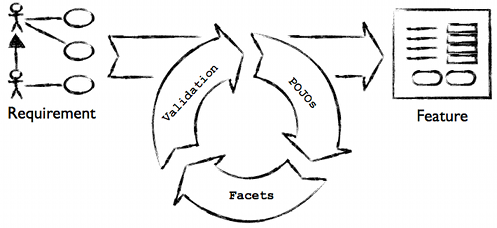
</center>

You basically start from the requirements (Use Cases or User Stories). Then, for each Use Case, you iterate on these 3 steps :

1. Write the POJOs 
2. Add some facets
3. Validate everything (either yourself for "micro iterations", or with the product owner when the result is testable)
  
Of course, the number of (micro) iterations depends on the complexity and requirements, but the principle always applies.

The many out-of-the-box, zero-LOC features that Woko provides also helps smaller iterations. Sensible defaults, convention over configuration, tooling etc. makes coding easier, thus shortening the cycles. The [Object Renderer](Object Renderer) helps you quickly validate the main principles of a feature before you get your hands in the real dirt. 

Most of the useful time used developing a good application is often spent in "details that matter". User interface, polishing… these are the differentiators today. The common, recurrent stuff should not require effort in order to work directly for you. Woko helps focusing on those details that matter, by providing a solid foundation you can build upon, iteratively.   

> Semantics and expressivity in the code have many positive side effects. It is the basis of Woko's [Object Renderer](Object Renderer) : using metadata in order to show Objects dynamically at runtime, without code generation of any sort. It also allows for better tooling, like the `woko` command-line script, the integrated Facet Studio, or the IntelliJ IDEA plugin : all rely on metadata in order to perform their tasks.  

## Quick validation ##

Requirements are a hard thing to capture. Nothing speaks more to an end user than working software, because words are often subject to interpretation. Code rarely is. Showing working code is, according to us, an essential part of requirements capture, as it allows to make sure we don't implement things based on a misunderstanding. 

With its built-in CRUD, Object Renderer and other "out of the box" features, Woko makes Domain Driven development a pragmatic reality. You can actually show many things and validate concepts with your end users before you start customizing anything. This makes you save an enormous amount of time. You can try out various solutions to solve your problems, without loosing time on building small prototypes that you trash away when they don't pass the user's validation.

## Prototyping and beyond ##

Many developers still consider "prototyping" as a one-shot-and-send-to-trash activity. In that scenario, the prototype is only supposed to help understand the requirements, and is used only as a "pre-validation" step, before serious coding begins. It usually comes under the form of mockups with text descriptions. Then the "prototype" is simply trashed because it simply cannot be turned to working, shippable software. Or it eventually gets out of sync with the actual code, unless you spend time updating the proto when you update the code...

We don't agree with this process. Woko proves that prototyping is part of the development cycle and should not be considered as a parallel, one-shot activity. 

Woko really shines in that early prototyping phase, because it doesn't require you to write much code in order to have something to play with. But that's just the beginning of your journey !

Once the feature has been roughly validated with the user and you know where you're going, then the prototype is a part of the application, and you build upon it in order to make it look and behave exactly as you want. You don't trash the Domain Objects, and you don't necessarily need to trash the Facets that you wrote. Of course you'll refine things, probably do some GUI etc. But you don't trash the base feature that you designed while prototyping : you build on it. It _is_ part of your application since the beginning.

In the next iteration, you'll probably extend the features already coded by reusing what's in place and adding to it, but following the same process : quickly model and test with your customers, and then take time for the (often very important) details.

The term "prototype", when developing a Woko application, only refers to a _phase_ of the project. It ain't no other technological or conceptual meaning, and requires no additional tools or methodology. It's all just coding.

## Customization ##

Almost everything in Woko is designed to be pluggable. The main components like [Object Store](Object Store) or [User Manager](User Manager) can be completely or partly replaced. Need another ORM ? Wanna go NoSQL ? Upgrading to LDAP ? All this can be adapted. Those abstractions makes the base system very agile as the application doesn't require much changes even if you replace some underlying system by another. The contracts are very simple and easy to implement. 

Also, the [Object Renderer](Object Renderer) and CRUD features are very flexible and can be customized easily. Hooks range from very small parts to the whole mechanism, so you can "cut the Woko branch" whenever you feel it's more pain than benefit. 

# Architecture #

Woko itself doesn't do much. It's nothing but a good mix of various technologies combined altogether. The core runtime has very few dependencies, basically [Stripes](http://www.stripesframework.org) and [JFacets](http://jfacets.rvkb.com) only. Then, pluggable components provide the necessary services, like persistence or user management.

The overall architecture looks like this :

<center>

</center>

## MVC Layer ##

The MVC layer is built on top of the fantastic Stripes framework. It's one of the few libs that Woko exposes directly, and that you will have to use when developing a Woko application.
	
Woko uses a main `ActionBean` for serving all the requests (excepted for static resources of course), along with several Stripes extensions that make binding, validation etc. work directly your Domain Objects and users.  

### WokoActionBean ###

It's the main Controller for the Woko app. Kind-of a "super dispatcher" that handles all requests and delegates to the appropriate facet. Unlike a typical Stripes app, a typical Woko application doesn't use several `ActionBean`s. They are replaced by `ResolutionFacet`s : facets that handle the http request, and return a Stripes `Resolution`.   

`WokoActionBean` also defines Woko's URL scheme. It responds to all requests that match its URL binding : 

    {facetName}[/{className}[/{key}]]

The following URLs are typical Woko URLs that WokoActionBean will handle by delegating to the appropriate components :

* `/view/Product/123`
* `/list/Product`
* `/home`
* `/doSomeFunkyStuff/MyClass/123?facet.myProp=123&object.myOtherProp=cool`

The URL scheme is an important part of Woko. The URLs reflect what they mean, they show the intent and target object. The different parts of the URL (`facetName`, `className` and `key`) are used by WokoActionBean in order to resolve the target object and Resolution Facet to be applied.

All parameters are prefixed with either `facet.` or `object.` : they will be bound respectively to the Resolution Facet and target Object, provided they satisfy the validation constraints if any. Like their cousins Action Beans, Resolution Facets has at least one event handler method, that returns a `Resolution`.

> NOTE : You can use ActionBeans in your app, there ain't no problems with that. It's only that ActionBeans don't work like ResolutionFacets : they don't apply to target types and roles. You'll use ActionBeans typically only for actions that apply to all users and have no particular target object. You can also use ActionBeans to write alternale "routes" to some ResolutionFacet, using the action's @UrlBinding and forwarding to another URL.  

### Stripes extensions ###

Woko adds several extensions to Stripes in order to make Resolution Facets work like Action Beans, with respect to Binding & Validation, Security, etc. They are implemented as Stripes `Interceptor`s and other components. Woko also registers custom `TypeConverter`s for transparent binding of Domain Objects.

## The Woko instance ##

There's only one Woko ! At least in your webapp… 

When the [application starts up](Startup), a `Woko` instance is created, initialized, and bound to the `ServletContext`. Then, from anywhere in the app, the `Woko` instance can be retrieved and used as an top-level entry point for executing various tasks.

## Mandatory Components ##

Woko delegates most of the job to sub-components :

* `ObjectStore` : Manages Object-Oriented persistence for your POJOs. Implements basic CRUD operations used by the default Woko features. Woko ships with a fully functional Hibernate implementation that uses JPA annotations for the mapping, and Hibernate Validator/javax.validation annotations. 
* `UserManager` : Handles users/roles and authentication. Simple contract that allows the framework to obtain the roles of the currently logged in user. Woko handles container (JEE) authentication and roles, as well as a built-in implementation for storing users in the database.
* `Facets` : a configured JFacets instance with built-in and application facets. By default Woko uses Annotated Facets (`@FacetKey`) and classpath scanning in order to avoid configuration.

Those components are made available to Woko following the Inversion Of Control (IoC) principle. A container holds all the components (mandatory and user-defined if needed) and can manage their dependencies. Woko retrieves the required components from the IoC container when needed.  

Of course, all those components are configurable, and completely pluggable. They are defined as interfaces and you can replace their implementation as you see fit.

## Typical Request Handling flow ##

Here is a dynamic view of a typical Woko request handling  :

<center>

</center>

It's a typical Stripes flow, spiced up with target object and resolution facet loading :

1. __Before__ - Stripes has created a WokoActionBean instance for the request, and invokes the _before_ interceptor. 
    * Request parameters `className` and `key` are used for retrieving the target Object using the `ObjectStore`. When using Hibernate, this ends up calling `session.load()` for the class and primary key. Here, we load the `Product` object with ID `123`.
    * Once the target `Product` object is loaded, it is used in order to retrieve the `ResolutionFacet` for requested name (`facetName` request parameter). If no facet is found, a 404 is raised. 
2. __Binding__ - Stripes binds the request parameters, with type converters and dynamic validation on the facet and target object :
	* `object.price=10` sets the `price` property of the `Product` target object
	* `facet.coupon=XYZ` sets the `coupon` property of the `ResolutionFacet` object  
3. __Event execution__ - Stripes invokes the event handler on `WokoActionBean`. This one delegates to the `ResolutionFacet`'s event handler, returning the `Resolution` to be used.
4. __Resolution execution__ - Stripes executes the returned `Resolution`, producing the HTTP response.

# Tutorial #

This tutorial aims at covering the main aspects of Woko through practical examples.

> We'll be using the default "Reference Implementation" (hibernate etc.), but the same concepts applies to other implementations of `ObjectStore`, `UserManager` etc. 

## Environment setup

You'll need to install the `woko` shell script to go through this tutorial. Follow instructions explained [here](The woko Script). 

Make sure the `woko` command is available in your PATH before you start.

## Project init

First off, open a command prompt, switch to a folder of your choice and create a new Woko project :

    $ woko init

The command will ask you for some basic info about your project. You can pick default values for everything excepted the `groupId` and `artifactId`  :

    $ woko init
    __       __     _  __
    \ \  _  / /___ | |/ / ___
     \ \/ \/ // o \|   K /   \
      \__W__/ \___/|_|\_\\_o_/  2.0
                 POJOs on the Web !

    Initializing project
    > Project name ? myapp
    > Maven groupId ? com.myco.myapp
    > Your project's version ? [1.0-SNAPSHOT] 
    | Generating your project, please wait, it can take a while to download everything...
    > Would you like to use Bootstrap for UI ? [y] :
    > Would you like to use Groovy ? [y] :
    > Specify your default package name [com.myco.myapp] :
    > Would you like enable the woko 'push' command ? [y] :
    |  - web.xml file created : src/main/webapp/WEB-INF/web.xml
    |  - Layout facet created : com.myco.myapp.facets.MyLayout
    |  - resource bundle created : myapp/src/main/resources/application.properties
    |  
    |  Your project has been generated in : myapp.
    |  Run 'woko start' in order to launch your app in a local Jetty container  


This creates a `myapp` project in the current directory. The project contains a configured pom.xml, a sample Domain Class, and an init listener for your app.

## Domain Classes

The very first step when starting a Woko app is to define the Domain Classes : the entities that represent your model. 

Here's the example that has been generated in our project :

    // src/main/groovy/myapp/com/myco/myapp/model/MyEntity.groovy

    package com.myco.myapp.model

    import org.compass.annotations.Searchable
    import org.compass.annotations.SearchableId
    import org.compass.annotations.SearchableProperty
    import javax.validation.constraints.NotNull

    import javax.persistence.Entity
    import javax.persistence.Id

    @Entity
    @Searchable
    class MyEntity {

        @Id
        @SearchableId
        Long id

        @NotNull
        @SearchableProperty
        String myProp

        Date myOtherProp

    }

And that's it. A `MyEntity` POJO with persistence, validation and full-text search enabled. Your class will be scanned at startup, and ready for use. 

> The built-in `HibernateCompassStore` supports Hibernate, Hibernate Validator and Compass mapping annotations. Refer to their docs for more infos about them.

## Full Defaults

You don't have to write anything more than a Domain Class to start playing with your application. Get back to your terminal, and start the app :

    $ woko start

This will compile and build the project, start jetty, and deploy your application. You can now point your browser to :

[http://localhost:8080/myapp](http://localhost:8080/myapp)

### Guest Home

What you'll see when visiting the app is the guest home page. That's what unauthenticated users see of your application by default. 

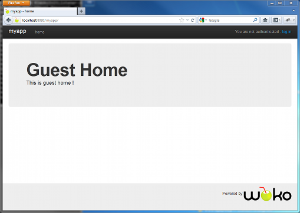

We have chosen not to show Domain Objects to guest users by default, so there's nothing more to see than this home page at the moment. Of course, you can easily change the contents of the default guest home page later, and provide access to your model as you want. 

### The developer role

By default, your Woko application includes a specific user, of role `developer`. This user has all CRUD privileges on your Domain Objects, plus a few "power features" that we'll explain later.

You can use the default credentials in order to log-in :

* username : wdevel
* password : wdevel

As you can see, developers also have their home page, but this time with a few items in the nav bar :

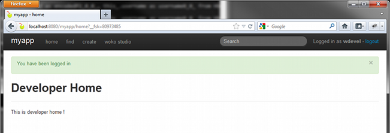

For now, let's try the CRUD features on our `MyEntity` Domain Class. 

### Zero-LOC CRUD 

Let's first create an instance of our Domain Class. Click the _create_ link in the nav bar :

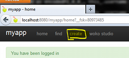

As you can see, Woko has found your Domain Class, you can select `MyEntity` from the list, and submit :

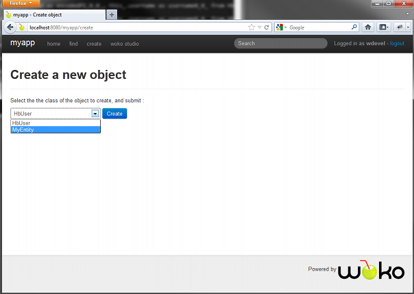

A FORM is generated for your POJO, with input fields for first-level properties :

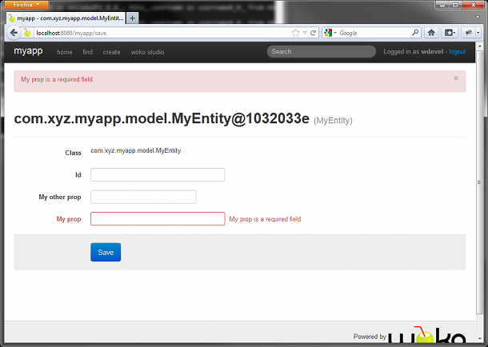

A few things to notice here :


* Woko has dynamically introspected your Domain Class, and rendered a FORM that allows to change its state. 
* Constraint Validations are taken into account (the `@NotNull` on `myProp`)
* Input fields are generated based on the type of the object's properties (there's even a date picker component for `myOtherProp`

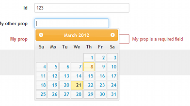

Now fill in some values and save :

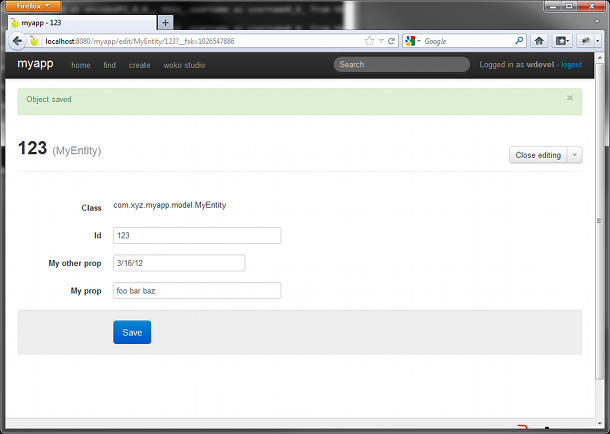

The object has been saved. We can now close the edit mode :

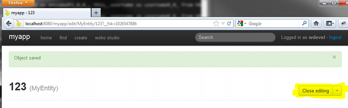

And now get a "read-only" view of our `MyEntity` instance :

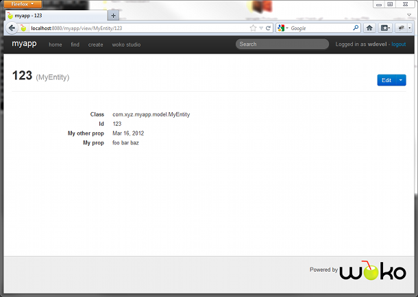

As you can see, Woko has now generated plain HTML for the object's properties. Again, it's using the types and metadatas found on the object (e.g. the formatted date). 

Developer users can also list objects by class :

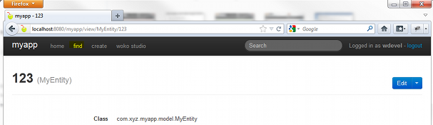

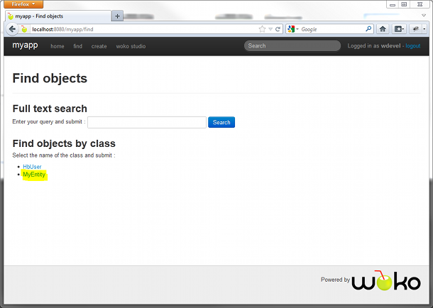

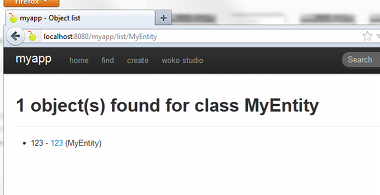

And use full text search, as defined in the POJO's annotations :

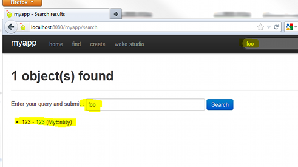

In short : all CRUD operations on your Domain Classes (plus full text search) are available for free. Woko generates the User Interface dynamically without you writing any single line of code for it.

### RPC and JavaScript ###

Woko includes out of the box support for RPC. All default features are available as JSON/HTTP services by default. Every feature covered by this tutorial so far can be realized using any code that speaks HTTP and JSON, using a simple protocol. 

With the app still running, log in as wdevel and try this :

[http://localhost:8080/myapp/save/MyEntity?object.id=123&object.myProp=foobar&createTransient=true&isRpc=true](http://localhost:8080/myapp/save/MyEntity?object.id=123&object.myProp=foobar&createTransient=true&isRpc=true)

The `isRpc` request parameter tells Woko that the request is to be handled as JSON/HTTP. Woko does the same job as usual, except that it returns the result of the operation as JSON. In this example, it returns the freshly created object :

    {
        "id": 123,
        "myProp": "foobar",
        "class": "MyEntity",
        "_wokoInfo": {
            "title": "123",
            "className": "MyEntity",
            "key": "123"
        }
    }

Again, all the features are available out of the box. For AJAX situations, it's even simpler using the `woko.rpc.Client` JavaScript API. It provides all default features, plus arbitrary facet invocation. 

Log in again as developer, open firebug and go to :

[http://localhost:8080/myapp/save/MyEntity?object.id=123&object.myProp=foobar&createTransient=true](http://localhost:8080/myapp/save/MyEntity?object.id=123&object.myProp=foobar&createTransient=true)

You have saved the object. Now go to firebug console and play :

    // load MyEntity with ID 123 and store to global for the example
    wokoClient.loadObject("MyEntity", 123, { 
        onSuccess: function(o) { 
            myEntity = o;
            console.log(myEntity);
        }
    });
    
You can even update the object :

    myEntity.myProp = "this is funky";
    wokoClient.saveObject({
        obj:myEntity, 
        onSuccess:function(savedObject) {
            console.log(savedObject.myProp); 
        }
    });

And check that it's been saved :

    wokoClient.loadObject("MyEntity", 123, { 
        onSuccess: function(o) { 
            console.log(o.myProp);
        }
    });   

## Overriding the defaults ##

This section explains how the default features can be customized. It shows some typical examples of changing Woko's behavior when you need it. It also gives a glance of how you can write Resolution Facets in your app to perform various tasks.

### Overriding the Object Renderer ###

TODO explain how you can override the title, properties etc. Show an example in edit mode.

### Resolution Facets ###

TODO explain how to completely override /view, and how to write a sample Resolution Facet that does something

### Templating ###

TODO explain how to change the layout for a given role (and object ?)

# Developer Guide #

This section explains how Woko works, and how to develop Woko-based applications.

## Main Components ##

Woko depends on several mandatory components in order to work. It uses abstractions (interfaces) for transversal services that can be implemented in different ways depending on your context. Concrete implementations of these components are shipped with Woko (e.g. `HibernateStore`), and you can of course write new ones.

These components must be supplied at startup to the Woko instance, via the IoC.

### Object Store ###

The ObjectStore manages Object persistence for your Domain Objects (POJOs). It provides the base CRUD operations on managed POJOs :

* provide a list of the "managed" Classes
* load/save/update/delete a managed POJO
* list all instances of a given managed Class (paginated)
* full-text search for managed POJOs (optional)

The contract of Object Store is defined by the interface `woko.persistence.ObjectStore`.

>Woko's persistence layer also includes abstraction for Transactions. If your store implements `woko.persistence.TransactionalStore`, then transactions will be automatically handled following the Open Session In View (OSIV) pattern (see `woko.actions.WokoTxInterceptor`).  


### User Manager ###

The UserManager handles users/roles for the application. It is a very simple view of the underlying user management system that only provides two methods :

* get the roles for a username : allows Woko to lookup facets for the user's roles
* authenticate a user

Woko ships with in-memory, container and hibernate enabled `UserManager`s. The contract is defined by interface `woko.users.UserManager`.

### Username Resolution Strategy ###

This component allows for pluggable authentication and user session management. It allows to change the way Woko retrieves the current username. 

For example, when using container authentication, it gets the username by calling `request.getRemoteUser()`, as per the servlet spec. Other implementations can use the http session, cookies, mocks for tests, or whatever else. 

### Facet Descriptor Manager ###

Facets in your application are scanned from the classpath by the Facet Descriptor Manager. It has to be configured with the base package(s) to scan (e.g. `com.myco.myapp.facets`).

You should not need to, but can also replace this component, in order to use a different form of facets (e.g. XML descriptor instead of Annotations). 

## Inversion of Control ##

Woko delegates management of the various sub components to an Inversion of Control "container". This allows to plug any component easier, and to manage their dependencies and lifecycle if needed. It also serves as a registry for any optional components, so that they can be accessed everywhere in the application. The woko instance itself is not in the container : instead it holds a reference to the container and retrieves the components from it.

The IoC container is defined by interface `woko.ioc.WokoIocContainer`, and is pluggable. Woko ships with a default implementation, and a [Pico Container](http://picocontainer.codehaus.org) adapter.

## Startup ##

Woko (and its sub-components) is created and initialized at application startup, using a servlet context listener. A base abstract class is provided (`woko.WokoIocInitListener`), that can be extended in order to configure Woko.

Here is an example using the `SimpleWokoIocContainer` :


    package com.myco.myapp

    class MyWokoInitListener extends WokoIocInitListener {

        @Override
        protected WokoIocContainer createIocContainer() {
        	
        	// create and init our store
        	ObjectStore store = new MyStore()
        
        	// create and init our user manager
        	UserManager userManager = 
        		new MyUserManager().addUser("wdevel", "wdevel", ["developer"])
    
        	// create and init the U.N.R.S (container auth)
        	UsernameResolutionStrategy unrs = new RemoteUserStrategy()
        
        	// create the annotated facet descriptor using 
        	// superclass method : it inits the F.D.M. with 
        	// the facet packages found in web.xml
        	IFacetDescriptorManager fdm = createAnnotatedFdm()
    
        	// create and return the IoC container
            return new SimpleWokoIocContainer(
                    store,
                    userManager,
                    unrs,
                    fdm);
        }
        
        @Override
        protected List<String> createFallbackRoles() {
        	// return the default role(s) for our app
            return ["myguest"]
        }
    }

The init listener has to be configured in web.xml :

    <?xml version="1.0" encoding="UTF-8"?>
    <web-app xmlns="http://java.sun.com/xml/ns/j2ee"
             xmlns:xsi="http://www.w3.org/2001/XMLSchema-instance"
             xsi:schemaLocation="http://java.sun.com/xml/ns/j2ee
             http://java.sun.com/xml/ns/j2ee/web-app_2_4.xsd"
             version="2.4">
    
    	…
    
    	<!-- Woko init listener : starts up Woko -->
        <listener>
            <display-name>WokoInitListener</display-name>
            <listener-class>com.myco.myapp.MyWokoInitListener</listener-class>
        </listener>
    
        … 
    
        <!-- facet packages -->
        <context-param>
            <param-name>Woko.Facet.Packages</param-name>
            <param-value>com.myco.myapp.facets</param-value>
        </context-param>
         
    … 
    
    </web-app>

### Groovy Init ###

Groovy Init is an alternative, more flexible way to startup Woko. It also uses a Servlet Context Listener in order to create Woko when the application starts, but this one delegates all the initialization to a Groovy script.

This is particularly handly when used in combination with [environments](Environments), so that you can create various flavors of Woko with the full power of a programming language, and depending on the context (test, prod, etc.).

To enable it, first you need to add the dependency to your ```pom.xml``` :

    <dependency>
      <groupId>com.pojosontheweb</groupId>
      <artifactId>woko-groovy-init</artifactId>
      <version>${woko.version}</version>
    </dependency>  

Then declare the init listener in ```web.xml``` (instead of a `WokoIocInitListener` subclass) :

    <listener>
      <display-name>WokoInitListener</display-name>
      <listener-class>woko.groovyinit.GroovyInitListener</listener-class>
    </listener>

Last, you need a ```/woko-init.groovy``` available in your CLASSPATH, that creates, configures and returns a Woko instance. 

Here is an example :

    // store
    MyStore store = new MyStore()
    
    // user manager
    MyUserManager userManager = new MyUserManager(...).createDefaultUsers()
    
    // facets
    def facetPackages = ["com.myco.myapp.facets"] + Woko.DEFAULT_FACET_PACKAGES
    AnnotatedFacetDescriptorManager fdm = new AnnotatedFacetDescriptorManager(facetPackages)
        .setDuplicatedKeyPolicy(DuplicatedKeyPolicyType.FirstScannedWins)
        .initialize()
    
    // ioc
    SimpleWokoIocContainer ioc = new SimpleWokoIocContainer(store, userManager, new RemoteUserStrategy(), fdm)
    
    // create and return woko !
    return new Woko(ioc, ["myguest"])

## Domain Objects ##

Domain Objects in Woko are POJOs. We don't use no meta-framework of any kind, only the Java type system. 

Woko manages your POJOs through the [Object Store](Object Store), which handles the persistence of your objects seamlessly. The store is created at startup and connects to an underlying database in order to save the state and provide access to your Objects. This can be implemented in many different ways, using an ORM, custom DAOs, or whatever you can think of. 

> The ObjectStore only implements the basic CRUD operations by default, but it's a good entry point to place more specialized accessors to your domain objects (e.g. queries) when you'll need them. Like other Woko components, it is accessible everywhere in your application. 

Woko heavily uses introspection (`java.lang.reflect`) in order to determine the properties to display etc. In general, your Domain Objects should be regular POJOs that follow the JavaBean convention. Woko's ObjectRenderer will work directly with objects that :

* have a default constructor (if you want to be able to create instances via the default generated interface)
* expose their properties with accessors following the JavaBean convention
* use generics for Collections and Maps (e.g. `List<MyClass>`) so that Woko knows the compound types

Woko ships with a `HibernateStore` that uses automatic classpath scanning, JPA annotations for the mapping, and `javax.validation`. 

## Facets ##

Woko uses facets for everything. Developing a Woko application is about writing Domain Objects and associated facets for the various roles of the application. 

[JFacets](http://jfacets.rvkb.com) is used with bare Annotated facets by default, so you just have to write a Java class with the `@FacetKey` annotation :

    @FacetKey(name="foo",profileId="myrole",targetObjectType=MyClass.class)
    class MyFacet … {
        …
    }

Woko scans configured packages in your CLASSPATH for annotated facet classes at startup. At run-time, Woko looks up the facets using a facet name, a target object, and the currently logged in profile. 

### Woko Facet Context ###

Facets implementing `IFacet` (all Woko facets do) may access the `WokoFacetContext` at runtime in order to retrieve various informations about the facet. It mainly provides access to the `Woko` instance, as well as the target object, used at runtime to retrieve the facet.

Here is an example :

    @FacetKey(name="test", profileId="myrole", targetObjectType=MyClass.class) 
    class MyFacet extends BaseFacet {
     
        void doSomethingWithTargetObject() {
            // retrieve the target object and cast it 
            MyClass my = (MyClass)getFacetContext().getTargetObject()
    
            // use target object methods...
            my.doSomething()
    
            // access the Woko instance and use ObjectStore 
            Woko woko = getFacetContext().getWoko()
            MyStore store = (MyStore)woko.getObjectStore()
            MyEntity e = store.load(...)
            ...
    } 

### Facet Lookup ###

All facet lookup is delegated to the Woko instance, via the `getFacet(…)` methods. JFacets is never invoked directly. Here is an example of how to retrieve a Facet :

    // somewhere in a web component...
    ServletContext servletContext = …     
    HttpServletRequest request = … 
    
    // grab the Woko instance
    Woko woko = Woko.getWoko(servletContext)
    
    // the target object of the facet
    MyClass targetObject = … 
    
    // retrieve the facet using woko
    MyFacet f = woko.getFacet("my", request, targetObject)
    
    // invoke the facet
    f.xyz()

When `getFacet()` is called, Woko retrieves the current username using the `UsernameResolutionStrategy`,  and attempts to retrieve the facet using the `JFacets` instance. This one delegates to the `UserManager` in order to get the roles for the current user.
  
When the facet is retrieved, it is automatically bound as a request attribute with the names `facet` and the actual name of the facet (in the example above, `my`), so it can be retrieved later on in the request processing chain, e.g. in a JSP using a scriptlet :

    <%
        MyFacet my = (MyFacet)request.getAttribute("facet");
        MyFacet my = (MyFacet)request.getAttribute("my");
    %>
    <p>
        <%=my.getFoo()>%>
    </p> 

Or EL :

    <p>
    ${my.foo}
    </p>

### Resolution Facets ###

`ResolutionFacet`s are to Woko what `ActionBean`s are to Stripes : they are the Controllers in the MVC. They basically respond to an URL, handle the http request, and return a Stripes `Resolution` that generates the response. 

#### URL Scheme ####

`WokoActionBean` dispatches incoming requests to Resolution Facets using the following URL binding :

    @UrlBinding("/{facetName}/{className}/{key}")

When a matching request is handled, WokoActionBean first loads the target object using `className` and `key` (if provided). Then it retrieves the resolution facet with name `facetName` using the target object. If no `key` is provided, then Woko tries to find the facet by type. If no `className` is provided, then Woko tries to find the facet for the type `java.lang.Object`. 

The `@FacetKey` in Resolution Facets determines its URL. Here are a few examples :

    /*
    	/foo/MyClass/123
    	/foo/MyClass
    */
    @FacetKey(name="foo", profileId="myrole", targetObjectType=MyClass.class)
    class MyResolutionFacet extends BaseResolutionFacet { 
    
    	@Override
        Resolution getResolution(ActionBeanContext abc) {
        	return new StreamingResolution("text/plain", "bar !")
        }
    
    }
    
    
    /*
    	/bar/MyClass/123
    	/bar/OtherClass/456
    	/bar
    */
    @FacetKey(name="bar", profileId="myrole") // no targetObjectType defaults to java.lang.Object
    class MyResolutionFacet extends BaseResolutionFacet { 
    
    	@Override
        Resolution getResolution(ActionBeanContext abc) {
        	return new StreamingResolution("text/plain", "bar !")
        }
    
    }

Of course Resolution Facets can return any type of Stripes `Resolution` (foward, redirect, stream, etc.).

#### Event handlers ####

Like Stripes ActionBeans, Woko's ResolutionFacets may have several event handlers. Woko will invoke one of them based on the presence of a request parameter. `@DontValidate` can be used to skip validation for an event.

The following example shows a typical Resolution Facet with 2 events :

    @FacetKey(name="doIt",profileId="muser",targetObjectType=MyClass.class)
    class DoIt extends BaseResolutionFacet {
    
        @Validate(required=true)
        String foo
    
        // Default Handler (from interface)
        @Override
        @DontValidate
        Resolution getResolution(ActionBeanContext abc) {
        	return new ForwardResolution(SOME_JSP)
        }
    
        // alternate event
        Resolution alternateEvent() {
        
            // retrieve target object
        	MyClass c = (MyClass)getFacetContext().getTargetObject()
        	
        	// update target object state
        	c.setValue(this.foo)
        	
        	// save to store
        	getWoko().getObjectStore().save(c)
        	
        	// redirect to default handler
        	return new RedirectResolution("/doIt/MyClass/${c.id}")
        }
    }

The event handlers are all public methods that return a `Resolution`, and possibly accept an `ActionBeanContext` as their only parameter (or no parameter at all) :

   * the default handler (`execute()`, from `ResolutionFacet`) that displays a page
      * `GET /doIt/MyClass/123`
   * the alternate handler (`alternateEvent()`) that modifies state and redirects to the initial page 
     * `POST /doIt/MyClass/123?facet.foo=bar&alternateEvent=anyValue`

Of course you can have as many handlers you want. 

> There are limitations concerning validation and event handling. For example, @Validate(on=xyz) is not yet supported. Refer to the javadocs (or source code) for up-to-date status.        

### Fragment Facets ###

Fragment facets are the heart of Woko's [ObjectRenderer](Object Renderer). Their role is to render a fragment (hence the name) of the page, and are included inside JSPs like this : 

    <%
        Woko woko = Woko.getWoko(application);
        MyClass my = … ;
        FragmentFacet ff = woko.getFacet("myFragment", request, my);
    %>
    <div>
    	<%--
    		render this block using a "myFragment" facet : the facet 
    		returns the path to the JSP to be included.
    	--%>
        <jsp:include page="<%=ff.getFragmentPath(request)%>"/>
    </div>

As other facets, the lookup is done using the currently logged-in user and the target object, which makes the fragment flexible and easy to change for the various Domain Objects and Roles of the application.
    
> The above scriptlet could be replaced by the use of the `<w:includeFacet/>` tag. See the [Tag Library](Tag Library) for more infos.

Fragment Facets must implement the interface `woko.facets.FragmentFacet`. Here is an example :

    @FacetKey(name="myFragment", profileId="myrole", targetObjectType=MyClass.class)
    class MyFragmentFacet implements FragmentFacet {
    
        @Override
        String getFragmentPath(HttpServletRequest request) {
            "/WEB-INF/jsp/my-fragment.jsp"
        }    
    }

### Tag Library ###

Woko includes a few tags that eases JSP writing :

* cacheToken : allows for easier browser caching of static resources
* facet : lookup a facet and bind it to the request
* includeFacet : lookup a fragment facet and include it
* link : create a link to a managed POJO
* title : return the title for a managed POJO
* url : export the URL to a resolution facet as a page variable
* username : return the name of the currently logged in user

The tags are implemented as JSP tag files, and are overlayed in your application by maven when you build. You only have to import the taglib in your JSP to start using them :

    <%@ taglib prefix="w" tagdir="/WEB-INF/tags/woko" %>

Or even import Woko's `taglibs.jsp`, it will import all the usual taglibs (Standard, Stripes, Woko etc.) :

	<%@include file="/WEB-INF/woko/jsp/taglibs.jsp"%>
	
Here is an example of using `<w:title/>` and `<w:url/>` in order to create a link to a managed POJO :

    <%-- somewhere in a JSP… --%>
    <c:set var="my" value="${…}"/>
    <w:url var="myUrl" object="${my}"/>
    <a href="${myUrl}">
    	<w:title object="${my}"
    </a>

> When you build your app, the tags are copied in `target/myapp/WEB-INF/tags/woko/`. You can look there for a full list of available tags.     

## Data binding and Validation ##

Data binding and Validation works on Target Objects and Resolution Facets like on regular Stripes ActionBeans. The main difference is that prefixes must be used for request parameters, because Stripes binds on `wokoActionBean.getFacet()` and `getObject()` :

* `object.prop` binds on `targetObject.setProp(converted_value)`
* `facet.prop` binds on `facet.setProp(converted_value)`

Here is an example.

The POJO :

    class MyClass {
    
    	…
    	String foo = "init value"
    
    }

The Resolution Facet :

    @FacetKey(name="doIt", profileId="myrole", targetObjectType=MyClass.class)
    class DoIt extends BaseResolutionFacet {
    
	    @Validate(required=true)
    	String bar
    
    	@Override
        Resolution getResolution(ActionBeanContext abc) {
        	MyClass c = (MyClass)getFacetContext().getTargetObject()
    		return new StreamingResolution("text/plain", "$c.foo $bar !")
        }
        
    }

The request :

    GET /doIt/MyClass/123?object.foo=no&facet.bar=way

And the response :

    no way !

For that request, `MyClass.foo` and `DoIt.bar` have been bound using the parameters `facet.foo` and `object.bar`.

### Type Converters for your POJOs ###

Woko automatically registers Type Converters into Stripes for your managed POJOs. This means that you can bind objects from the ObjectStore using only their ID. 

The following example binds a List of MyClass objects :

    // no target type needed for this demo, applies
    // to all Objects or null
    @FacetKey(name="bindMyPojo", profileId="myrole")
    class BindMyPojo extends BaseResolutionFacet {
    
    	List<MyClass> myClass
    
    	@Override
        Resolution getResolution(ActionBeanContext abc) {
    		return new StreamingResolution("text/plain", "count=${myClass.size()}")
        }
        
    }

The request :

    GET /bindMyPojo?facet.myClass[0]=123&facet.myClass[1]=456

And the response :

    count=2

Woko's Type Converters use supplied ID and introspected property types in order to load your POJOs from the store during the binding/validation phase.  

### Nested Validation ###

TODO explain dynamic validation metadata provider

For example, you can use `@Validate` on your Resolution Facets :

    @FacetKey(name="foo", profileId="myrole", targetObjectType=MyClass.class)
    class FooResolutionFacet extends BaseResolutionFacet {
   
        @Validate
        String bar
       
        …
       
    }
    
You can also use `@ValidateNestedProperties` in order to tell Stripes to look for `@Validate` recursively :

    @FacetKey(name="foo", profileId="myrole", targetObjectType=MyClass.class)
    class FooResolutionFacet extends BaseResolutionFacet {
   
        @ValidateNestedProperties 
        MyClass my
       
        …
       
    }
    
    class MyClass {
    
    	@Validate
    	String bar
    	
    }
    
> You can also use nested validation with your ActionBeans if you write any. It offers a more flexible, run-time aware validation scheme, where you can delegate validation to ActionBean properties instead of specifying everything in the Action itself. 

## Object Renderer ##

The Object Renderer allows Woko to display POJOs as read-only or read-write pages, so that users can view or change their state. It uses introspection and Fragment Facets in order to display everything dynamically : Woko doesn't generate any code, it's all done on-the-fly using types and medatata found on your objects. 

Here is a schematic break-down of the Object Renderer's facets :


A `layout` facet controls the global page template, and then a composite use of various fragments (`renderObject`, `renderProperties`) are involved in order to display your POJOs dynamically. Composition (container fragments including nested sub-fragments) is used in order to provide several different levels of granularity :

* page template
   * navigation
   * object 
      * title
      * links
      * properties
         * name & value
         * ...
         
Woko provides generic implementations of these fragment facets, that can render any POJO using reflection in order to grab the properties of the object. The default rendering will thereby display all the properties of a POJO, using built-in fragment facets. 

In order to change the rendering for a given POJO or property, you just need to override the appropriate facet. The composite, nested structure allows you to change all, or part of the rendering for your Domain Objects and roles. 

### Layout ###

The global page template is done using Stripes Layouts, and controlled by the `layout` facet (`woko.facets.builtin.Layout`). This one returns the layout JSP to be used, as well as the CSSs and JavaScripts to be included in the page.

The `layout` facet is used in all "top-level" Woko JSPs. A default one is provided for role "all", so you can override it for your roles and objects in order to change the template of the page :

	@FacetKey(name="layout", profileId="myrole")
	class MyLayout extends LayoutAll {
	
		@Override
    	String getAppTitle() {
        	"MyApp"
    	}

		@Override
    	List<String> getCssIncludes() {
        	["/css/my.css"]
    	}	
    	
		@Override
		String getLayoutPath() {
        	"/WEB-INF/jsp/myrole/layout.jsp"
    	}
    	    	
	}
	
The JSP layout is regular Stripes. The default one is overlayed in your app (see `/target/javadocproxy/WEB-INF/woko/jsp/all/layout.jsp`), and of course you can use your own in order to apply a different page template to the whole app. 
	
#### Nav Bar ####

The default layout includes a `navBar` facet that renders navigation links for the currently logged-in user. Nav bars for `all` and `developer` roles are included by default. 

You can override the `navBar` facet fragment completely, or simply override `getLinks()`, which returns a list of `Link` objects to be used by the default fragment :

    @FacetKey(name="navBar", profileId="myrole") 
    class NavBarMyRole extends NavBarAll {
    
        @Override
        List<Link> getLinks() {
            [ 
                new Link("/myUrl", "my"),
                new Link("/myOtherUrl", "other"),
                new Link("/myLastUrl", "link")
            ]
        }
    
    }

### Fragments ###

Fragments in the Object Renderer are nested. The structure is composite : a top-level fragment includes other fragments, possibly including other sub-fragments, and so on. This allows you to customize the rendering with different levels of granularity : either the whole object, or only a part of it.

#### renderObject ####

This fragment facet is the entry point of the Object Renderer. It renders a block for the facet's target object, and delegates the contents to other facets. Overriding this facet changes the rendering for the whole object. You will only keep the main layout. 

    @FacetKey(name="renderObject", profileId="myrole", targetObjectType=MyClass.class)
    class RenderObjectMyClass extends RenderObjectImpl {
    
        @Override
        String getPath() {
            "/WEB-INF/jsp/myrole/renderObject-myclass.jsp"
        }
    
    }
    
And the JSP (using Woko's `title` tag for the example) :

    <%@include file="/WEB-INF/woko/jsp/taglibs.jsp"%>
    <c:set var="my" value="${renderObject.facetContext.targetObject}"/>
    <div class="wokoObject">
        <h1><w:title object="${my}"/></h1>
        <p>
            This is my ! Foo = ${my.foo}
        </p>
    </div>

> An alternate `renderObjectEdit` is used when editing the object.

#### renderTitle ####

Used to render a title for the target object. It is used by `renderObject`, and whenever a title is needed, like in links or HTML page titles.

By default it will look for a title-like property on your POJO (like `name` or `title`), and default to the object's key (ID) if no such property exists. 

You can override it in order to create more meaningful titles for your POJOs :

    @FacetKey(name="renderTitle", profileId="all", targetObjectType=MyClass.class)
    class RenderTitleMyClass extends RenderTitleTimpl {
    
        @Override
        String getTitle() {
            MyClass my = (MyClass)facetContext.targetObject
            return "I am ${my.foo}" // use foo as title for objects of type MyClass            
        } 

    }

`renderTitle` is a FragmentFacet, so you can override `getPath()` too if you want to change the JSP used in order to render the title.         

#### renderLinks ####

Renders a list of links for the currently displayed object. Allows the user to trigger actions or navigate when browsing your POJOs. 

By default, it includes links for CRUD features by checking if the user can edit, delete the object etc. This is done by trying to lookup the `save`, `delete`, etc. ResolutionFacets for the POJO and the current user. Links to these facets are included if the facets are available. 

This facet can be overriden in order to add links for your POJOs and users. Here's an example that renders different links on a `Product` object, depending on the user's role.

For `customer` : 

    @FacetKey(name="renderLinks", profileId="customer", targetObjectType=Product.class)
    class RenderLinksProductCustomer extends RenderLinksImpl {
    
        @Override
        List<Link> getLinks() {
            Product p = facetContext.targetObject
            return [
                new Link("/addToCart/Product/$p.id", "Add to cart"),
                new Link("/emailToFriend/Product/$p.id", "Email to a friend")
            ]
        }
    }

And for `admin` :

    @FacetKey(name="renderLinks", profileId="admin", targetObjectType=Product.class)
    class RenderLinksProductAdmin extends RenderLinksImpl {
    
        @Override
        List<Link> getLinks() {
            Product p = facetContext.targetObject
            [
                new Link("/manageStock/Product/$p.id", "Manage stock"),
                new Link("/disable/Product/$p.id", "Disable from catalogue")
            ]
        }
    
    }

Depending on the user's role, different links will be rendered when browsing a `Product` object.

> An alternate `renderLinksEdit` is used when editing the object.

#### renderProperties ####

Renders the properties section for a POJO. Provides the list of the properties to be displayed, and the fragment used. The generic default version will simply output all readable properties, by delegating to sub-facets for each property.

It's common to override this facet in order to restrict the number of properties shown for a POJO and a role. Here's an example that restricts to some properties for the class `Product` and the role `customer` :

    @FacetKey(name="renderProperties", profileId="customer", targetObjectType=Product.class)
    class RenderPropertiesProductCustomer extends RenderPropertiesImpl {
    
        @Override
        List<String> getPropertyNames() {
            ["name", "image", "description", "price"]
        }
    }  
    
Another one for `admin` users, that only removes some unwanted props from the generic list :

    @FacetKey(name="renderProperties", profileId="admin", targetObjectType=Product.class)
    class RenderPropertiesProductAdmin extends RenderPropertiesImpl {
    
        @Override
        List<String> getPropertyNames() {
            def all = new ArrayList<String>(super.getPropertyNames())
            all.remove("id") // no need to show the ID
            all.remove("class") // get rid of getClass() - geeky and useless here
            return all 
        }
    }  

> Note that removing the props from the list returned by the generic `RenderPropertiesImpl` allows new properties of the POJO to appear automagically, but it can have side effects : you may not want your users, or some of them, to see this new property. Returning a "hard-coded" list requires to update the facet whenever a property is added or removed, but it allows to ensure what is displayed.

Of course `renderProperties` being a Fragment Facet, you can even change the backing JSP in order to change the markup wrapping the properties. Woko includes two modes by default : tabular-like, with property names, or "flat", just spitting out values in blocks one after the other. See `RenderPropertiesImpl#setUseFlatLayout` for more infos.   
 
> An alternate `renderPropertiesEdit` is used when editing the object, thet wraps the properties in a HTML FORM.

#### renderPropertyName ####

Renders the name of a POJO's property. Uses `MyClass.myProp` style names by default and looks up for an externalized message in the app's resource bundles. 

This facet is not usually overriden as you can change the labels from the property files. It's there in case you really wanna change the rendering for a property name.

#### renderPropertyValue ####

Renders the value of a POJO's property. Defined by the interface `woko.facets.builtin.RenderPropertyValue`, it comes with several implementations in order to handle the primitive types and associations between POJOs.

There are two ways to override `renderPropertyValue` facets :

* by _type_ : the type of the property (boolean, String, MyClass, etc.) is used to lookup the facet, which is assigned to the type of the property
* by _name_ : the name of the property is used to lookup the facet, which is assigned to the _target object_'s type (not the property)

This allows to override globally (using the type), for all properties of a given type, or specifically, only for a given property of a given target type. Here under are two examples.

By type (will be used anytime a POJO has a property of type `Address`):

    @FacetKey(name="renderPropertyValue", profileId="customer", targetType=Address.class) 
    class RenderPropValueBigDecimalCustomer extends RenderPropertyValueImpl {
    
        @Override
        String getPath() {
            "/WEB-INF/jsp/customer/renderPropValue-address.jsp"
        }
    
    }
    
By name (will be used for `address` property of `User` objects) :

    @FacetKey(name="renderPropertyValue_address", profileId="customer", targetType=User.class) 
    class RenderPropValueBigDecimalCustomer extends RenderPropertyValueImpl {
    
        @Override
        String getPath() {
            "/WEB-INF/jsp/customer/renderPropValue-address.jsp"
        }
    
    }
    
Again, it's important to notice that the facet's `name` and `targetObjectType` are different when you override either by type or by name. When overriding by type, the built-in facet name `renderPropertyValue` is used and the facet is assigned to the type of the property. When overriding by type, the name of the facet must be suffixed with the property name, like `renderPropertyValue_address`, and the target type is the owning object's type, not the property's type.

As a result, when writing the JSP view that backs a `renderPropertyValue` fragment facet, you should not access the facet's target object. Instead, use `RenderPropertyValue#getPropertyValue` and `RenderPropertyValue#getOwningObject` that return the property value and owning object consistently for the two modes.

Here is a fictious JSP that backs our `renderPropertyValue` facet for the `address` property of a `User` object :

    <%@ page contentType="text/html;charset=UTF-8" language="java" %>
    <%@include file="/WEB-INF/woko/jsp/taglibs.jsp"%>
    <c:set var="user" value="${renderPropertyValue.owningObject}"/>
    <c:set var="address" value="${renderPropertyValue.propertyValue}"/>
    <address>
        <strong>${user.firstName} ${user.lastName}</strong><br>
        ${address.street}<br>
        ${address.city}, ${address.postCode}<br>
        <abbr title="Phone">P:</abbr> ${user.phone}
    </address>

> An alternate `renderPropertyValueEdit` is used when editing the object.

## Localization ##

TODO explain how to use application.properties, Woko.getResource() and <fmt:message/>.

## Build ##

Maven is used to build Woko and Woko-based apps. Your project's `pom.xml` should contain all required Woko dependencies and plugins.

### Dependencies ###

Dependencies of your project may vary depending on your Woko "flavor". Some modules can be replaced by others (like authentication), and some are optional (like User Management and Registration). 

The best way to start is to create a project using the "Reference Implementation". It's the default config that we use when starting a new project. This can be done by using the `woko` script :

    $> woko init
    …

This will create a pre-configured project that you can use as a basis for plugging in optional modules or changing some components.

### Dependencies and War Overlays ###

Woko uses [war overlay](http://maven.apache.org/plugins/maven-war-plugin/overlays.html) in order to copy the built-in JSPs into your app. They are copied under `/target/myapp`. 

The `war` dependencies in your pom should be specified in the correct order. 

Again, run `woko init` in order to see how it's done by default.  

### Environments ###

Environments allow to have different resources depending on the context (e.g. production, test, dev, etc.). They are plain folders under the project root :

    myapp/
        environments/
            dev/
                log4j.properties
                hibernate.cfg.xml
            prod/
                log4j.properties
                hibernate.cfg.xml                    

You can switch from various environments easily using the `woko-maven-plugin`. It is included in your `pom.xml` when you create your project with `woko init`, and attached to the `process-resources` phase so that it kicks in automatically when you build the app. 

       $> mvn clean install -Dwoko.env=prod
       
The plugin will recursively copy (and thereby possibly overwrite existing resources) the files found in the environment folder `<project_root>/environments/myenv` to the `target/classes` folder of your project. 

The plugin will also generate a `woko.environment` file containing the name of the environment used at build-time. You can get the environment inside your running app by calling `Woko#getEnvironment()`.

Your pom should look like this :

    <plugin>
        <groupId>com.pojosontheweb</groupId>
        <artifactId>woko-maven-plugin</artifactId>
        <version>${woko.version}</version>
        <configuration>
            <!-- optional : specify default environment to be used if not passed on the cmd line -->
            <defaultEnv>dev</defaultEnv>
        </configuration>
        <executions>
            <execution>
                <id>woko.environment</id>
                <phase>process-resources</phase>
                <goals>
                    <goal>env</goal>
                </goals>
            </execution>
        </executions>
    </plugin>


## Tooling ##
### The woko Script ###
#### woko push ####
### IntelliJ IDEA plugin ###
## Unit Testing ##

Woko includes utility classes for out-of-container unit testing (see `woko.mock.MockUtil`). It is based on Stripes' [MockRoundtrip](http://www.stripesframework.org/display/stripes/Unit+Testing) and allows to emulate a running WokoActionBean and unit-test your facets.

The beauty of Mockroundtrip is that you can invoke ActionBeans via URLs in your unit tests, with all Stripes features enabled (binding/validation, type conversion etc). 

Here's an example (Groovy version) :

    import woko.mock.MockUtil
    
    class MyTest {
    
    	// create, init and return a new Woko : you can configure 
    	// your testing Woko as you want. Either the same as your webapp
    	// or using different components/configurations
    	Woko createWoko(String username) {
    		return new Woko(…) 
    	}
    	
    	@Test
    	void testIt() {
    	
    		// need a Woko to run our tests… 
    		Woko woko = createWoko('myuser')
		
    		// use Callback to wrap execution and use an automatically
    		// initialized/destroyed MockServletContext 
            new MockUtil().withServletContext(createWoko(), { MockServletContext ctx ->
            
            	// trip and retrieve a facet via its URL        
    			def myFacet = MockUtil.tripAndGetFacet(ctx, "/doIt/MyClass/123")
    			// make sure the facet class is the expected one
    			assert myFacet.getClass() == MyFacet.class
    			// make sure myFacet.myProp is null
    			assert myFacet.myProp == null
    			
    			// now trip with parameters
    			myFacet = MockUtil.tripAndGetFacet(ctx, "/doIt/MyClass/123", ['facet.myProp':'foobar'])
    			// make sure the facet class is still the expected one
    			assert myFacet.getClass() == MyFacet.class
    			// make sure myFacet.myProp has been bound
    			assert myFacet.myProp == 'foobar'
    			
            } as MockUtil.Callback)
    	}
    
    }

As you can see, `MockUtil` provides a simple way to create the MockServletContext (and close it automatically), as well as several static methods that eases test writing. The only thing you need to do is to create a `Woko` instance and feed it to MockUtil.

Here's an example of how you can do this easily (Groovy again), with your own Object Store etc. :

    Woko createWoko(String username) {
    
    	// create store using my own ObjectStore implementation
    	// and pre-populated with some testing objects
    	ObjectStore myStore = createObjectStoreWithTestObjects()
    	    
    	// same for user manager : init with test users/roles  
        UserManager userManager = createUserManagerWithTestUsers()
        
        // use mock UNRS so that we can emulate logged in users
    	UsernameResolutionStrategy unrs = new MockUsernameResolutionStrategy(username)
    	
    	// create FDM : we provide our facet packages just like in web.xml
    	List facetPackages = ['com.myco.myapp.facets'] + Woko.DEFAULT_FACET_PACKAGES
	    IFacetDescriptorManager fdm = Woko.createFacetDescriptorManager(facetPackages)
    	
    	// create IoC
        SimpleWokoIocContainer ioc = new SimpleWokoIocContainer(
                store,
                userManager,
                unrs)
                
        // create and return Woko with fallback guest roles
        return new Woko(ioc, ['myguest'])
    }

> If your ObjectStore is a `TransactionalStore`, the mock testing will use `WokoTxInterceptor`, and demarcate the transactions for each call to `tripXyz()`, just like it'd be done in a regular servlet request handling. On the other hand, be careful to properly handle transactions for all code that uses your ObjectStore in your test besides calls to `tripXyz()` : the tx interceptor is fired only when MockRoundtrip executes, so other calls in your tests should handle the transactions themselves. 

# Add-ons #
## User Management ##
## Asynchronous Jobs ##
# Performance #
## Browser caching & static resources ##
## Hibernate 2nd level cache ##
        